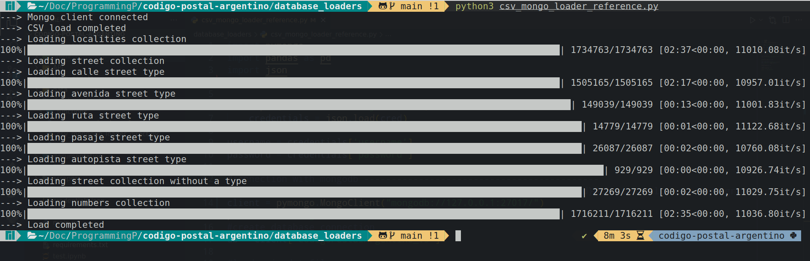

<h1 align='center'>Codigo postal argentino</h1>

<h2>Reto o consigna inicial</h2>

Conseguir el nuevo codigo CPA desde la pagina https://codigo-postal.co/ y cargarlos en archivos csv.

<h2>Propuesta de solucion</h2>

La propuesta es usar scraping para conseguir los codigos que estan alojados en tablas desde diferentes endpoints, despues se procedera a transformarlos y por ultimo a cargarlos en un csv.

<h3>Herramientas</h3>

 &nbsp Python

 &nbsp Scrapy

 &nbsp Pandas

Se usaran spiders para navegar por todos los links que contienen datos.

<h2>Complicaciones</h2>
<ul>
    <li>Diseño de pagina heterogenio: La pagina no es consistente en sus etiquetas html y css, ya que se encontraron al menos 4 diseños lo que dificulto el armado de los spiders. </li>
    <li>Nombres de localidades mal escritos: Algunos nombres de localidades estaban mal escritos lo que conllevo mas trabajo en pandas.</li>
</ul>

<h2>Conclusiones y solucion</h2>

Se utilizarion 2 spiders para scrapear la informacion, se hizo un trabajo de transformacion en pandas de datatype, orden e eliminacion de datos erroneos, faltantes o mal obtenidos.

El proceso de scraping es lento con una duracion de casi 2 hs, y el archivo es muy grande para subirlo a github, por eso se opto por subirlo comprimido en formato parquet.

<pre>
total_filas = 1734763
total_columnas = 9
archivos_parquet = 1
tamaño_archivos_parquet = 29.5mb
csv_final_descomprimido = 157.5mb
</pre>

<h2>Conversor parquet a csv</h3>

Para convertir los archivos .parquet a .csv ejecutar el script de python situado en la carpeta ETL llamado<b>"ETL_parquet_to_csv_conversor.py"</b>.

<pre>

pip install -r requirements.txt
cd ETL
python3 ETL_parquet_to_csv_conversor.py
</pre>

<h2>Base de datos</h2>

La base de datos usada es mongodb, se diseñaron 3 formas de estructuracion de archivos, directa, embeded y por referencia, siendo por referencia la arquitectura pedida. Para cargar los archivos en mongodb se tiene que llenar la variable -uri- en <b>credentials.json</b> y despues seguir los siguientes pasos. 

<pre>
#1 Asegurarse de tener el archivo CPA_data_converted.csv en la carpeta data/
#2 Correr el siguiente script
cd database_loaders
python3 csv_mongo_loader_reference.py
</pre>

<h2>API</h2>

