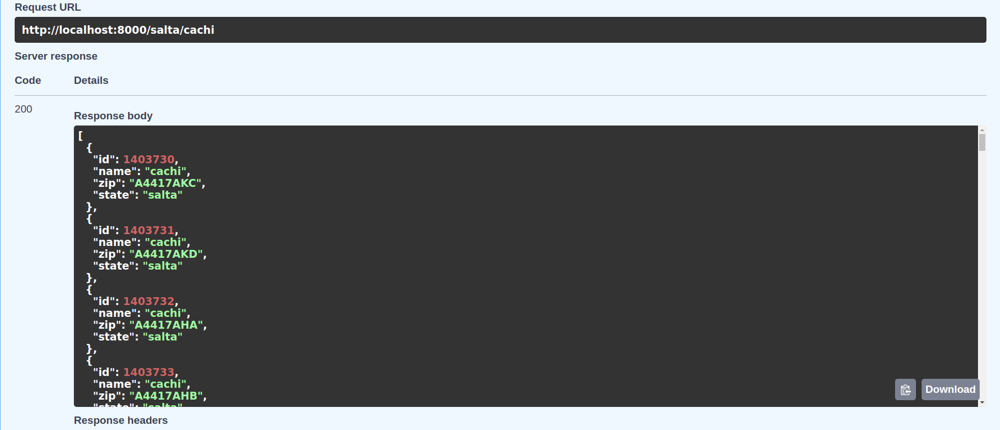
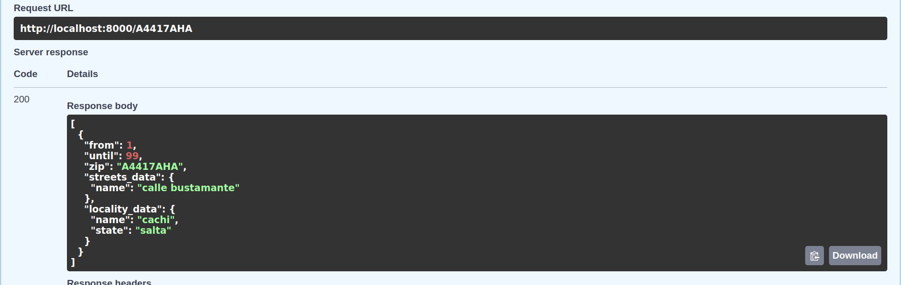
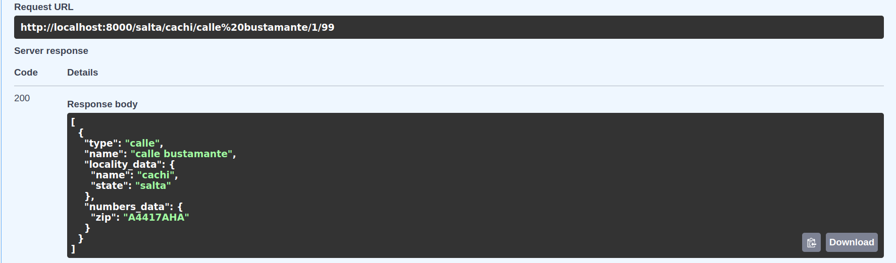
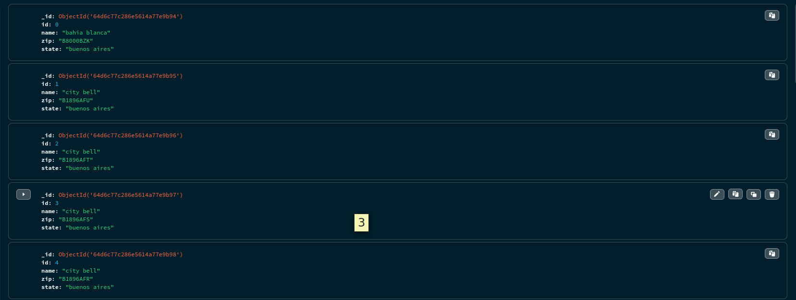
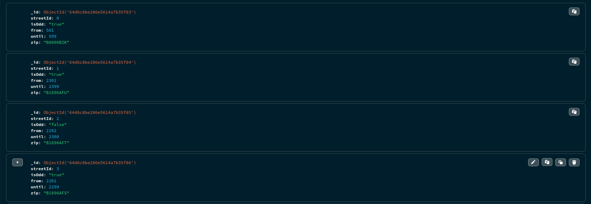
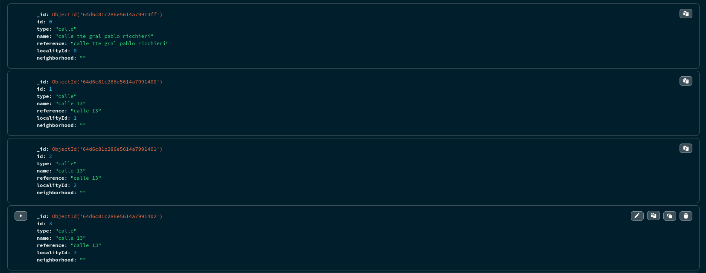

<h1 align='center'>API</h1>
<h2>Local</h2>
<pre>
docker build -t apicpa .
docker run --name apicpac -p 8000:8000 apicpa
</pre>

<pre>
#endpoints

"/{provincia}/{localidad}"

"/{provincia}/{localidad}/{calle_avenida}/{desde}/{hasta}"

"/{cpa}/"
</pre>

<h2>Database</h2>

La base de datos es Mongodb con 3 colecciones "localities". "numbers", "streets" y tienen la siguiente estructura.

<h3 align="center">Localities</h3>

<h3 align="center">Numbers</h3>

<h3 align="center">Streets</h3>

